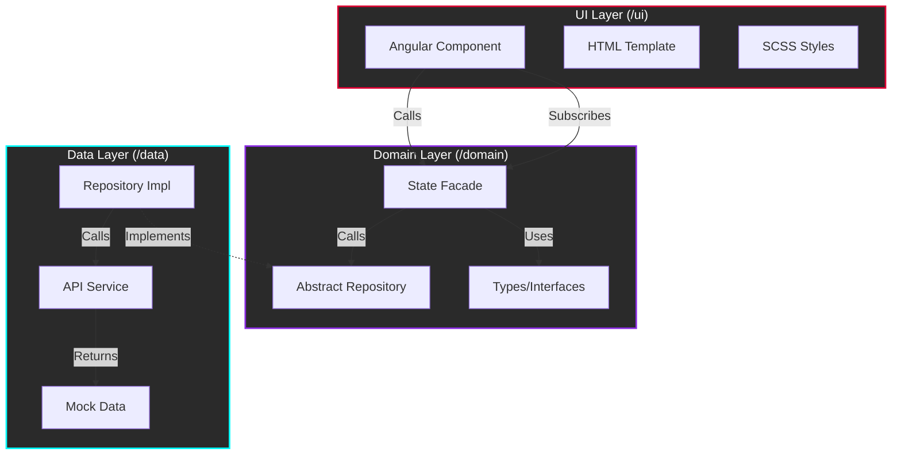

<div align="center">

# ⚛️ QuantumCart Web

### A Next‑Generation E‑Commerce Interface Prototype


<br>

> **QuantumCart** is a forward‑looking Progressive Web App (PWA) showcasing modern Angular architecture, reactive state management, and a distinctive **Cyberpunk / Glassmorphism** design language.
>
> Built to explore how **clean architecture**, **signals**, and **immersive UI** can coexist in a real‑world e‑commerce scenario.

[Vision](#-vision--philosophy) • [Architecture](#-architecture-standards) • [Features](#-feature-specifications) • [Setup](#-installation--development)

</div>

---

> [!IMPORTANT]
> **Mock Data Mode**
>
> QuantumCart currently runs fully in‑memory. All users, products, and orders are simulated.
> Data **resets on page reload**.

---

## 🏗 Architecture Standards

We strictly adhere to **Feature-Sliced Clean Architecture**.



### Why This Matters

* **Predictability**: UI logic never leaks into data or domain layers.
* **Testability**: Business rules are framework‑agnostic.
* **Scalability**: Each feature behaves like a self‑contained micro‑app.

---

### The 3-Layer Strict Boundary

Every feature (e.g., `auth`, `cart`) is an isolated "micro-app" containing three specific sub-directories.

<details>
<summary><b>🔍 Click to expand Architecture Details</b></summary>

#### 1. Domain Layer (`/domain`)
The **Software Core**. It has **ZERO** dependencies on Angular UI, HTTP, or Router.
- **Models**: `auth.model.ts` (Interfaces defining data shape).
- **Repositories**: `auth.repository.ts` (Abstract classes defining data contracts).
- **Facades**: `auth.facade.ts` (The public API for the UI).

#### 2. Data Layer (`/data`)
The **Infrastructure**. It implements the Domain.
- **Repository Impl**: `auth.repository.impl.ts` (Concrete class implementing the abstract repository).
- **Repositories**: `auth.service.ts` (Currently returns `of(MockUsers)`).
- **Mocks**: `mock-users.json.ts` (Static JSON data used to simulate API responses).

#### 3. UI Layer (`/ui`)
The **Presentation**. It knows *nothing* about business logic.
- **Components**: `login.component.ts`.
- **Templates**: `login.component.html`.
- **Styles**: `login.component.scss`.

</details>

### The Facade Pattern

We intentionally avoid Redux/NGRX. **Facades** act as the single source of truth for each feature.

1.  **Component** subscribes to `cartFacade.cart$`
2.  **Component** calls `cartFacade.addToCart(item)`
3.  **Facade** handles logic & updates the `BehaviorSubject`.

---

## 📂 Project Structure

A specialized directory tree designed for scalability.

<details open>
<summary><b>📂 src/app/features (Interactive Tree)</b></summary>

```text
src/app/features
├── auth
│   ├── data               # Implementation of Auth Logic
│   ├── domain             # Interfaces & Facades
│   └── ui
│       ├── forgot-password
│       ├── login
│       └── register
├── cart
│   ├── data               # Cart Logic (Calculation)
│   ├── domain             # Cart Models
│   └── ui
│       ├── cart-page      # Full Cart View
│       └── checkout-page  # Checkout Form
├── orders
│   ├── data
│   ├── domain
│   └── ui                 # Order History List
├── products
│   ├── data
│   ├── domain
│   └── ui
│       ├── components
│       │   └── product-card  # Reusable "Neon" Card
│       ├── product-detail    # Single Product View
│       └── product-list      # Grid View
├── profile
│   └── ui                 # Edit Profile Form
├── splash
│   └── ui                 # Cinematic Intro
└── stores
    ├── data
    ├── domain
    └── ui                 # Store Map Locator
```
</details>

---

## ✨ Feature Specifications & Roadmap

### ✅ Implemented Features (Basic Level - Grade 6)

#### 1. Product List (Shopping Menu) ✅

* Multi-page display with pagination
* Sorting (price, name, rating)
* Category filtering
* Advanced filtering (brand, availability, supplier, price range)
* Product info: name, price, description, add to cart
* Availability indicator (stock status badges)
* Product detail page with full description, technical details, warranty, official product link

#### 2. Shopping Cart ✅

* Product list in cart
* Quantity management
* Price per item
* Total price
* Tax display (19% VAT)
* Delivery cost breakdown
* Payment and delivery method selection
* Guest checkout (currently requires login)
* Place order functionality

#### 3. Login, Registration, Profile ✅

* Registration form, data storage
* User profile (name, email, delivery address, phone)
* Login system
* Profile editing, forgot password flow

#### 4. Past Orders ✅

* Only for registered users
* Order number, status, product names, quantities, order date, total price

#### 5. Language Selection ✅

* Language switcher on all pages (EN/DE)
* Full translation coverage
* Flag icons (🇬🇧 🇩🇪)

### 📋 Documentation Requirements ✅

* README file (enterprise-grade)
* Project structure & API documentation
* Installation guide
* Agile metrics methodology, sprint/cycle activity review, retrospectives

### 📈 Agile & Sprint Review

* Kanban-based workflow
* 4 weekly sprints completed (Saturday → Friday)
* Critical analysis: Facade pattern simplified state, initial mock data refactored for advanced filtering

### 🚀 Advanced Features (Optional - Grades 7-10)

* Store/Branch list with address, hours, contact, map
* Reviews & enhanced product/store images
* Page transitions, hover animations, glassmorphism design
* Responsive & accessible (a11y) design
* Multiple browser support, semantic HTML, ARIA labels, keyboard navigation, tooltips, skip-to-content, form label associations

### 📅 Roadmap for Missing Features

* Wire to backend API/Supabase
* Replace `of(MOCK_DATA)` with HttpClient
* Configure production environment
* Implement JWT interceptor & global error handling

### 📊 Current Grade Estimate

* Implemented: 100% Basic + Advanced Features ✅
* Grade Potential: 10.0
* Missing Critical: None
* Recently Completed: Documentation overhaul, linting, accessibility fixes ✅

---

## 💻 Installation & Development

### Prerequisites
- **Node.js** v20+
- **npm** v10+

### Quick Start

```bash
# 1. Clone & Install
git clone https://github.com/your-username/quantumcart-web.git
cd quantumcart-web
npm install

# 2. Run Dev Server
ng serve
# -> http://localhost:4200

# 3. Test
ng test
```

---

## ❓ Troubleshooting

<details>
<summary><b>Q: Port 4200 is in use?</b></summary>
Run <code>ng serve --port 4300</code> to pick a different port.
</details>

<details>
<summary><b>Q: Styles look broken?</b></summary>
Ensure you ran <code>npm install</code> to fetch the Angular Material stylesheets.
</details>

---

<div align="center">

**QuantumCart** • Engineered for the Future.

</div>

